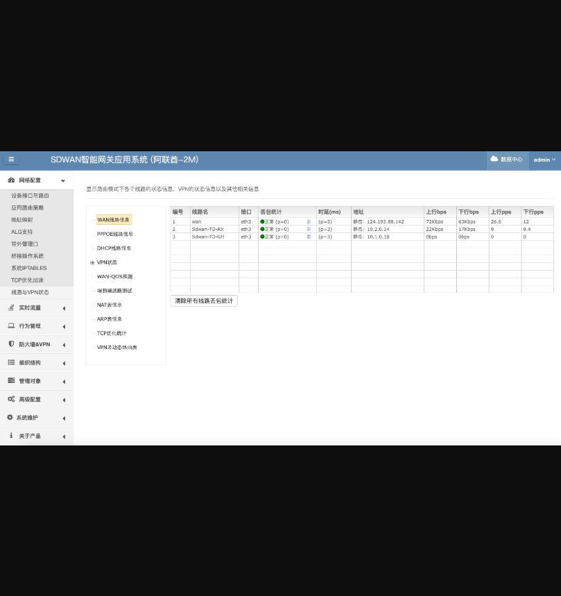
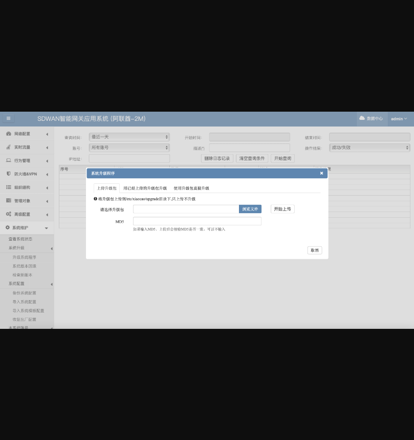
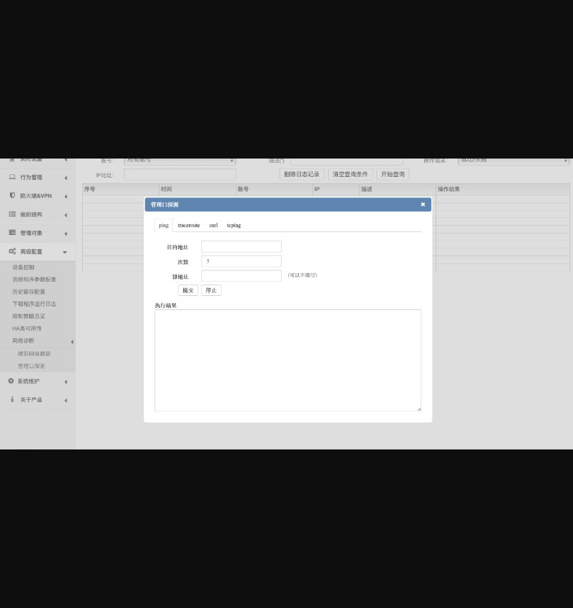

## SDWAN智能网关应用系统弱口令和后台任意文件上传等漏洞

## 漏洞描述

SDWAN智能网关应用系统自爆弱口令，后台任意文件上传，命令执行等等漏洞

## 漏洞影响

> SDWAN智能网关应用系统

## FOFA

> "”unierm_brand/logo.png”"

## 漏洞复现

1）登录界面

2）登录处程序员直接把默认口令给到了咱们，直接用默认口令登录进去

3）后台有很多功能，大家自己测吧。

