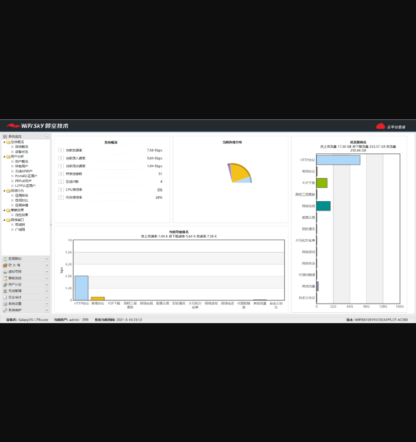
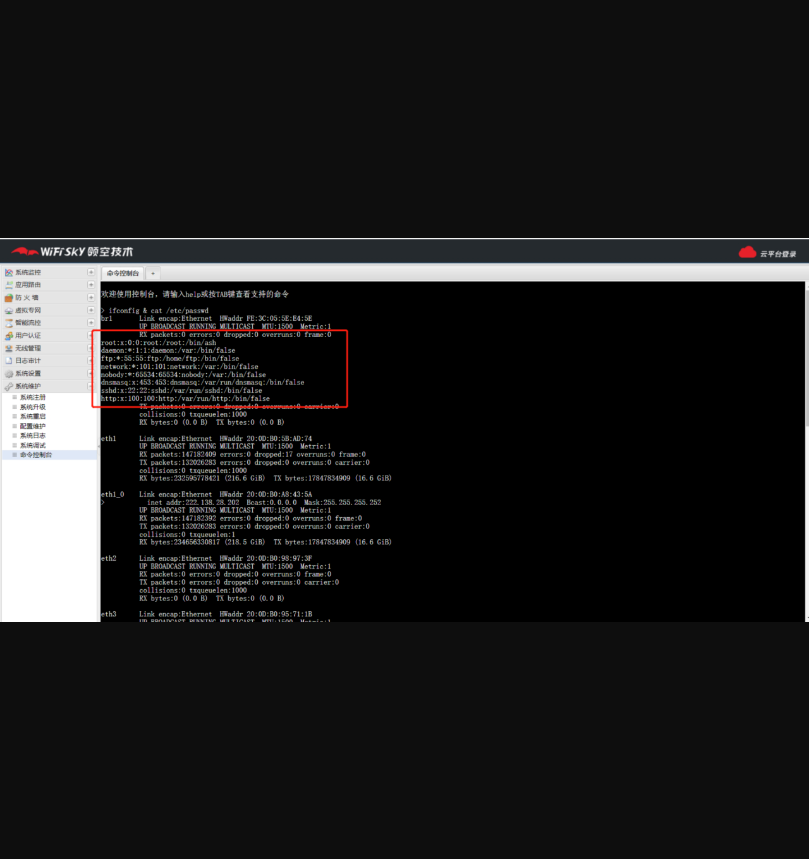

# WIFISKY-7层流控路由器后台任意命令执行

## 漏洞描述

深圳市领空技术有限公司WIFISKY-7层流控路由器后台任意命令执行，攻击者可以通过登录弱口令进入后台执行任意命令。

## 漏洞影响

> WIFISKY-7层流控路由器

## FOFA

> app="WIFISKY-7层流控路由器"

## 漏洞复现

1）登录界面如下

2）默认密码登录 admin/admin，登录界面如下

3）点击系统维护 执行支持的命令后面加入&跟系统命令如ifconfig & cat /etc/passwd 

 