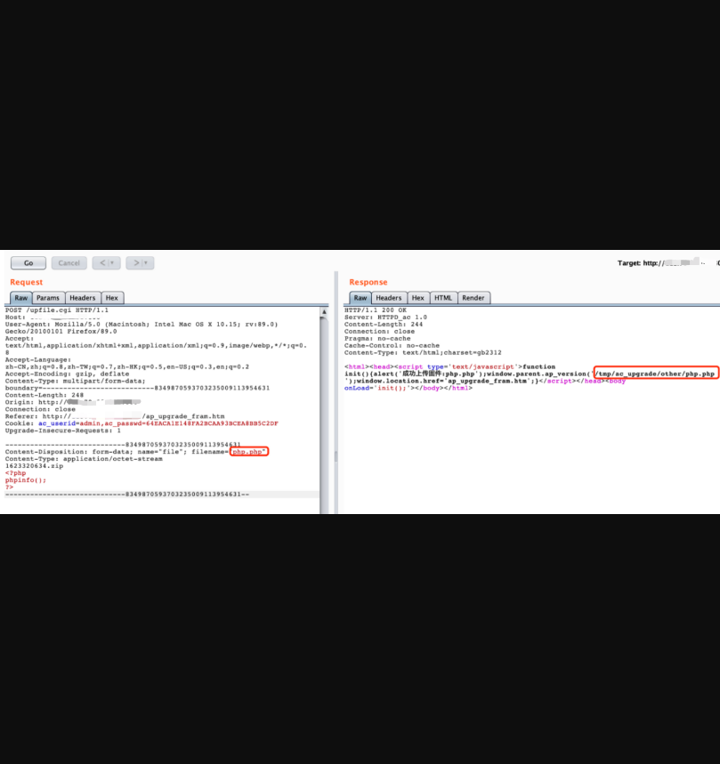

# 安网科技-智能路由系统后台任意文件上传

## 漏洞描述

广州安网贝腾信息科技有限公司智能路由系统AC集中管理平台存在任意文件上传，攻击者可以通过此漏洞上传webshell。

## 漏洞影响

> 智能AC管理系统

## FOFA

> title="安网科技-智能路由系统"

## 漏洞复现

1）登录界面如下

默认弱口令admin/admin，登录成功界面如下(几乎都存在默认口令)

### 在后台系统配置->AP系统管理->AP固件升级处可以上传文件，并且为前端验证，可以修改后缀绕过前端验证。

想GETSHELL？ 请自己动脑筋，我太菜我不会。 

### 