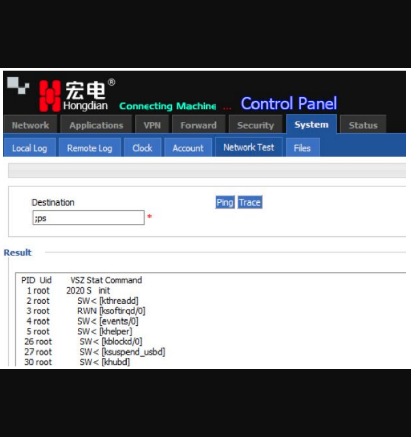
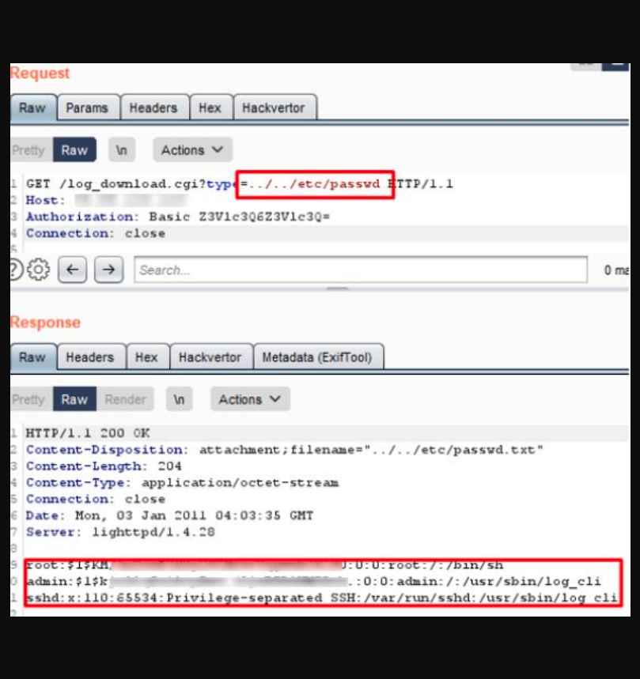
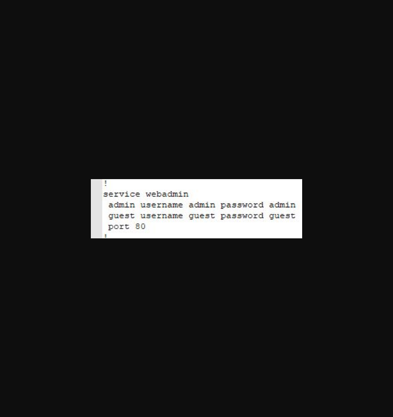

(1)、后门:
通过telnet服务在端口5188上使用默认账号密码：root ：superzxmn即可无限制登录，并且不会有记录。

(2)、命令执行
在后台网络诊断处的/tools.cgi没有对用户输入的参数进行过滤，导致了具有最小权限的攻击者可以通过命令拼接来执行操作系统的任意命令。

(3)、任意文件读取
/log_download.cgi日志导出处理程序不验证用户输入，可以进行任意文件下载和读取，例如“/../etc/passwd”

(4)、敏感信息泄露
通过http://[ip]/backup2.cgi访问设备系统配置（cli.conf）的文件可获取管理员账号密码
