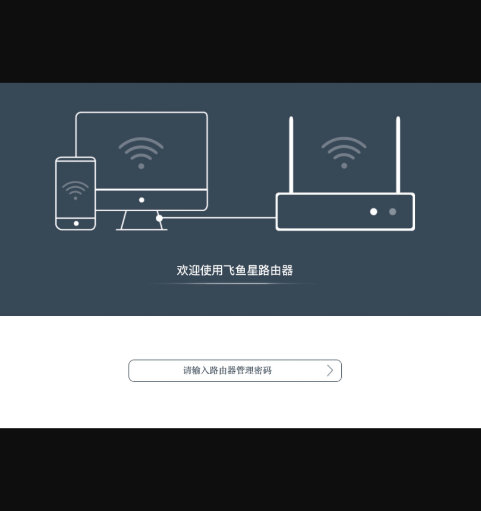
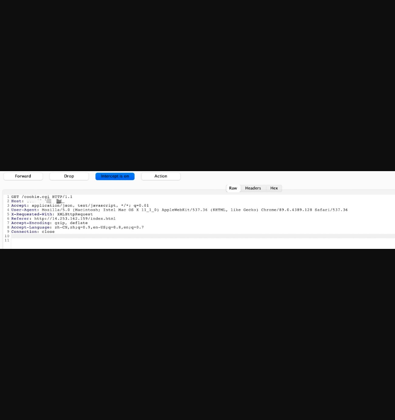
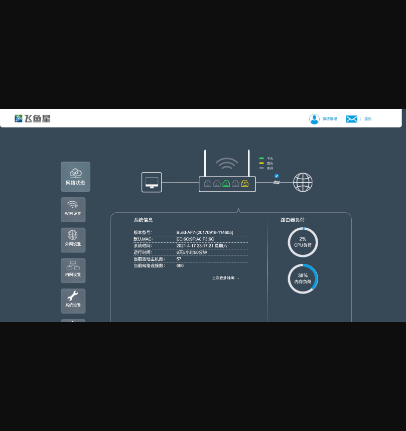

# 飞鱼星 家用智能路由 cookie.cgi 权限绕过

## 漏洞描述
飞鱼星 家用智能路由存在权限绕过，通过Drop特定的请求包访问未授权的管理员页面

## 漏洞影响
`飞鱼星 家用智能路由 `

## 漏洞复现
`FOFA: title="飞鱼星家用智能路由"`
登录页面如下

访问 index.html 时会请求 cookie.cgi

`http://xxx.xxx.xxx.xxx/index.html`
页面抓包 Drop掉 cookie.cgi

跳转后台获取了权限

其中很多产品都存在请求 cookie.cgi，同样的方法可以绕过  